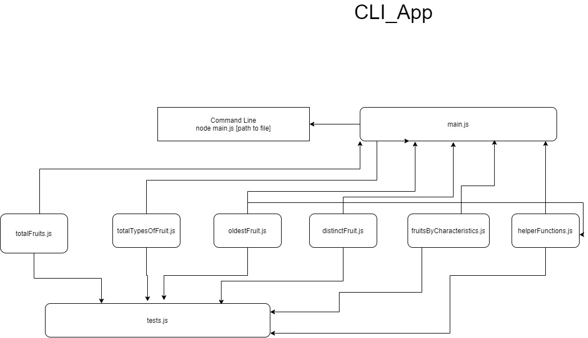
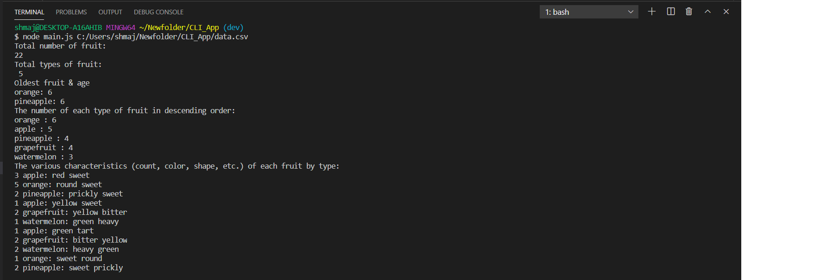

# CLI_App

## Command Line App

### Author: Shubham Majumdar

### Links and Resources
* [submission PR](https://github.com/smajumdar22/CLI_App/pull/1)

#### Documentation
* A user should be able to create the report by providing the path to the CSV-file to the application.
* The CSV-file represents a catalog of all the fruit in a fruit bowl.

### Setup
#### `.env` requirements (where applicable)
* git clone https://github.com/smajumdar22/CLI_App.git
* cd CLI_APP
* npm install

#### How to initialize/run your server app (where applicable)
* `node main.js [path to csv file]`
  
#### Tests
* How do you run tests?
  npm test

#### UML

